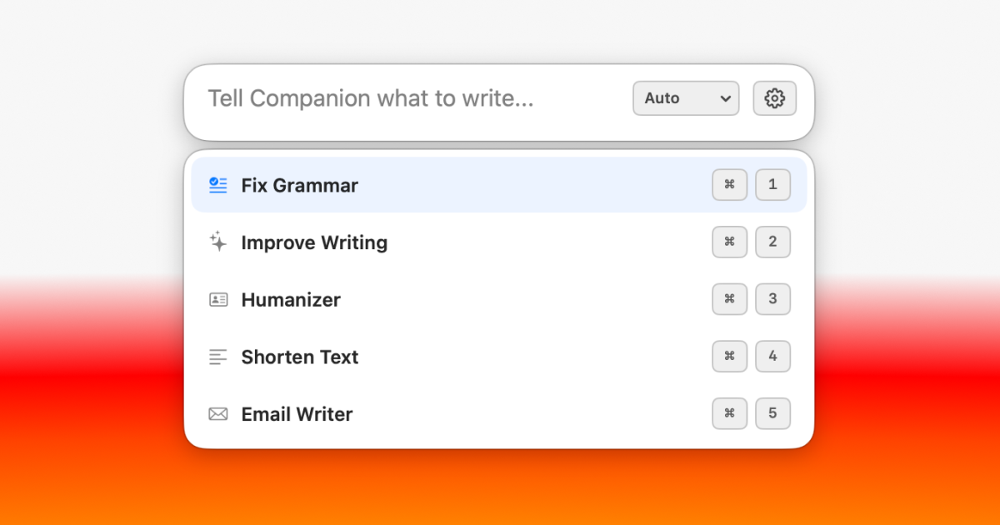
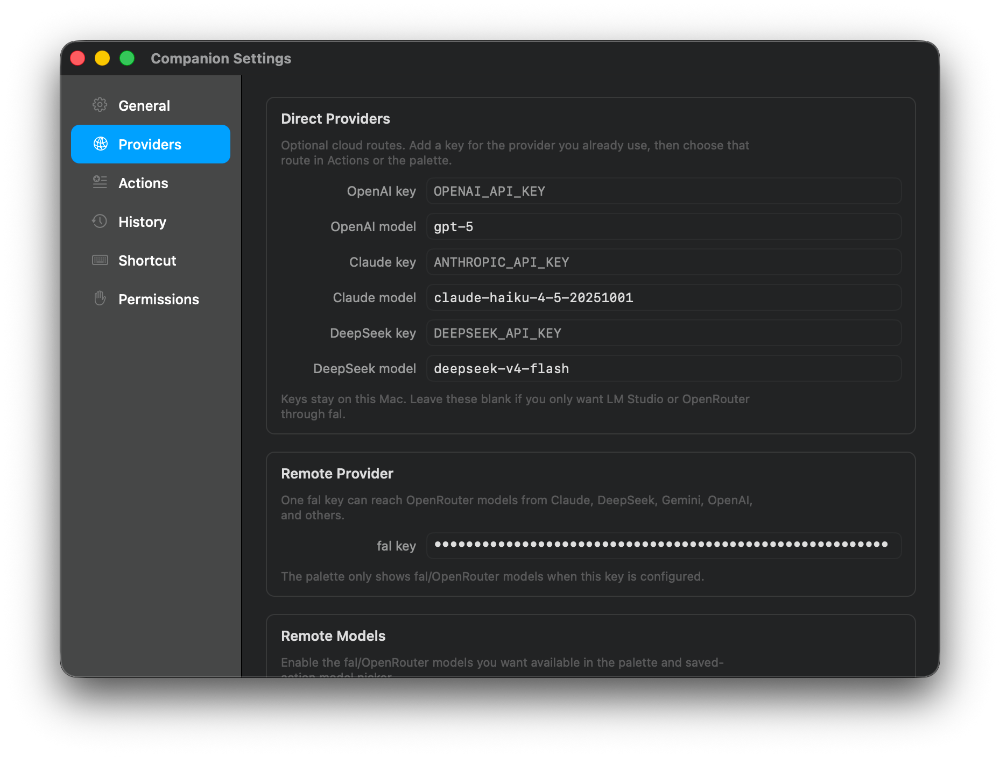
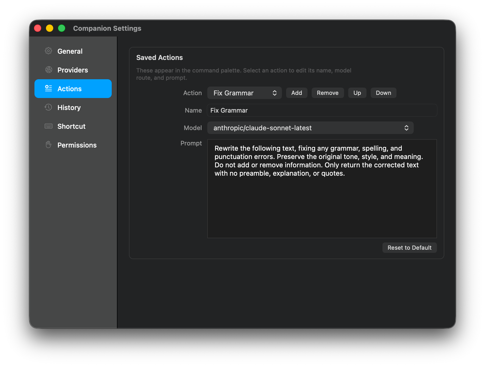
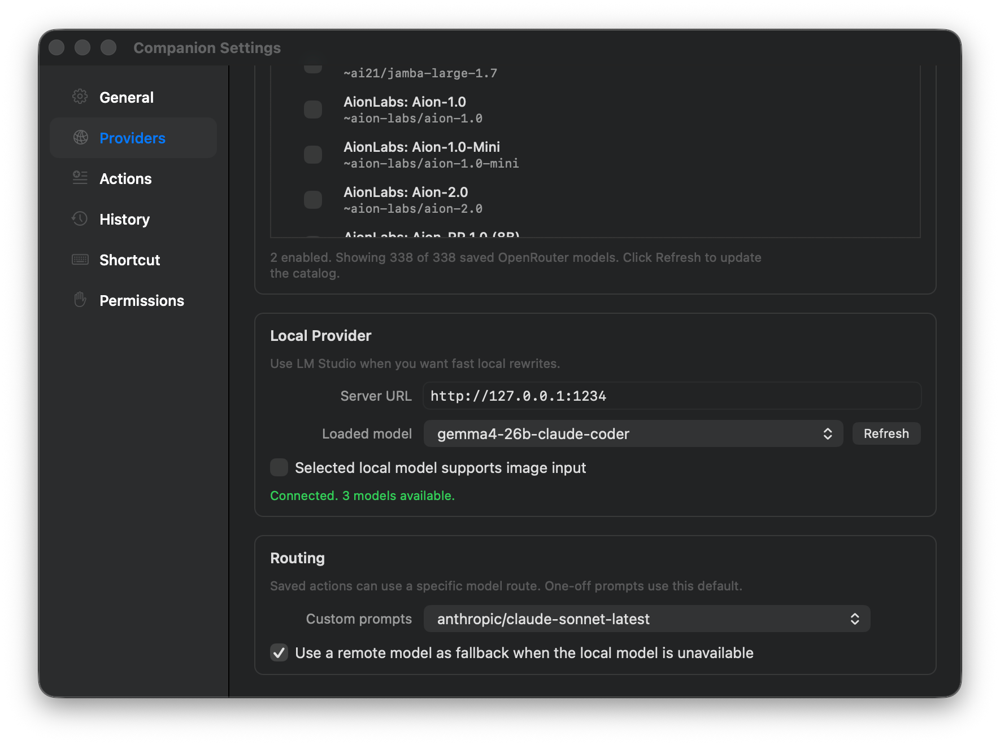

<h1>Companion</h1>

<p>AI writing wherever you work</p>

<p><strong>Version 0.2.2</strong> · macOS 13+ · Apple Silicon & Intel</p>

<p>
  
  
  
  
</p>

<p><a href="https://github.com/madebysan/companion/releases/latest">Download Companion</a></p>



Companion is a macOS menu bar app for quick writing tasks. It works in Mail, Notes, Notion, Slack, browsers, code editors, and most places you can select or write text. Use a saved action like "Fix Grammar" or "Shorten Text", or type a one-off prompt when the edit is specific.

Companion is an evolution of [Rewrite](https://github.com/madebysan/rewrite), another simpler Mac app tackling a similar use case.

https://github.com/user-attachments/assets/dff2816f-f1be-4334-ae09-69ea52ab66cf

## What it does

- Run custom prompts for one-off edits.
- Fix grammar without changing the meaning.
- Improve rough writing while keeping your voice.
- Humanize AI-sounding text.
- Shorten text or make it more formal.
- Turn messy notes into an email.
- Bring your own key, or use LM Studio locally for free.

## How it works

1. Select text in another Mac app.
2. Press the global shortcut. The default is `Cmd + Shift + E`.
3. Choose a saved action, or type something like `make this warmer and shorter`.
4. Companion sends the request to the model route you chose.
5. The result replaces the selected text and stays on your clipboard.

If no text is selected, Companion treats your custom prompt as a request to create new text and inserts the result wherever your cursor is.

## Providers

Use one route, or mix them per action:

- **LM Studio:** local models on your Mac, usually through `http://127.0.0.1:1234`.
- **fal / OpenRouter:** one key for Claude, OpenAI, Gemini, DeepSeek, and other remote models.
- **Direct providers:** your own OpenAI, Claude, or DeepSeek key and model name.

Each saved action can have its own default route or model.

## Settings

Settings is where you add provider keys, choose which remote or local models appear in the model selection, and edit saved actions.







## Privacy

There is no Companion server, account, analytics, or telemetry. Companion stores settings, API keys, prompts, routes, shortcuts, and generated result history on your Mac. For local LM Studio runs, the request stays on your Mac.

For cloud runs, Companion sends the selected text and your prompt to the provider route you selected. Generated history stores the result and metadata, not the original selected text or image bytes.

## Install

1. Download the DMG from [Releases](https://github.com/madebysan/companion/releases/latest).
2. Drag `Companion.app` to Applications.
3. Open Companion. It appears in the menu bar.
4. Pick a provider during onboarding, or skip and configure providers later in Settings.
5. Grant macOS permissions when prompted:
   - Accessibility lets Companion copy selected text and paste the result.
   - Input Monitoring lets the global shortcut work while another app is focused.
6. Relaunch Companion after granting both permissions.

If macOS keeps an old permission entry after an update, remove Companion from both permission lists, add it again, then relaunch.

## Build from source

```bash
git clone https://github.com/madebysan/companion.git
cd companion
swift build -c release --package-path Companion --arch arm64 --arch x86_64
./script/build_and_run.sh --verify
```

To build a signed DMG on a Mac with the configured Developer ID identity:

```bash
./script/build_dmg.sh
```

For a public release DMG, notarize and staple the app and DMG:

```bash
./script/build_dmg.sh --notarize
```

## Requirements

- macOS 13 Ventura or later
- Apple Silicon or Intel Mac
- Accessibility permission
- Input Monitoring permission
- Optional: LM Studio for local models
- Optional: OpenAI, Anthropic, DeepSeek, or fal API key for cloud models

## Tech stack

- Swift and AppKit
- Swift Package Manager
- [HotKey](https://github.com/soffes/HotKey) for global shortcuts
- LM Studio local server support
- OpenAI-compatible chat routes for fal/OpenRouter, OpenAI, DeepSeek, and local models
- Anthropic Messages API for direct Claude support

## License

[MIT](LICENSE)

---

Made by [santiagoalonso.com](https://santiagoalonso.com)
